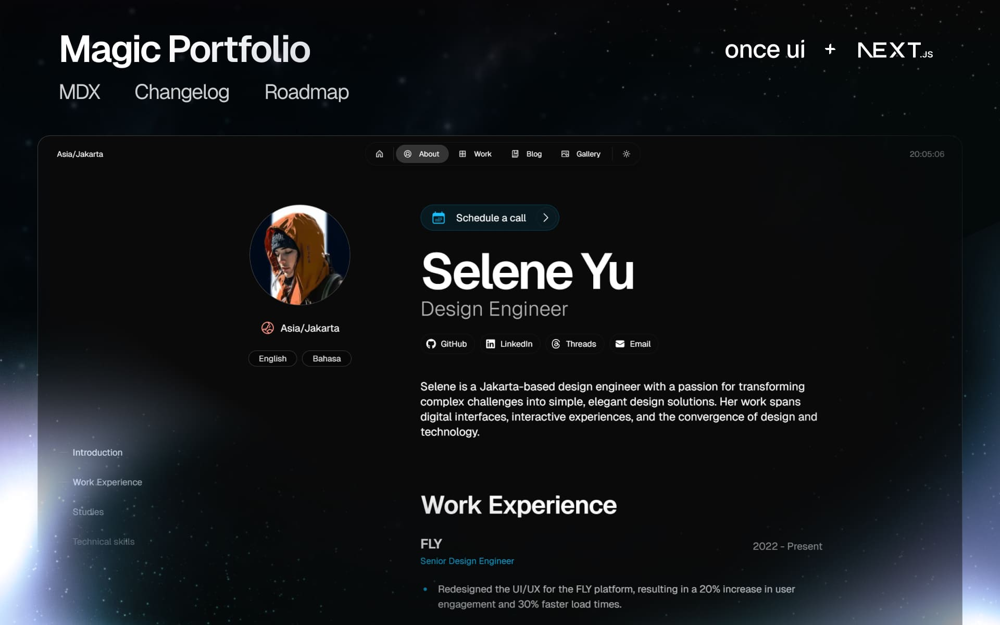

# Magic Portfolio

Magic Portfolio is a simple, clean, beginner-friendly portfolio template. It supports an MDX-based content system for projects and blog posts, an about / CV page and a gallery.



## Getting started

**1. Clone the repository**

```
git clone <your-repo-url>
```

**2. Install dependencies**

```
npm install
```

**3. Run dev server**

```
npm run dev
```

**4. Edit config**

```
src/resources/once-ui.config.ts
```

**5. Edit content**

```
src/resources/content.tsx
```

**6. Create blog posts / projects**

```
Add a new .mdx file to src/app/blog/posts or src/app/work/projects
```

## Features

### SEO

- Automatic open-graph and X image generation with next/og
- Automatic schema and metadata generation based on the content file

### Design

- Responsive layout optimized for all screen sizes
- Timeless design without heavy animations and motion
- Endless customization options through data attributes

### Content

- Render sections conditionally based on the content file
- Enable or disable pages for blog, work, gallery and about / CV
- Generate and display social links automatically
- Set up password protection for URLs

## License

Distributed under the CC BY-NC 4.0 License.

- Attribution is required.
- Commercial usage is not allowed.

See `LICENSE` for more information.
